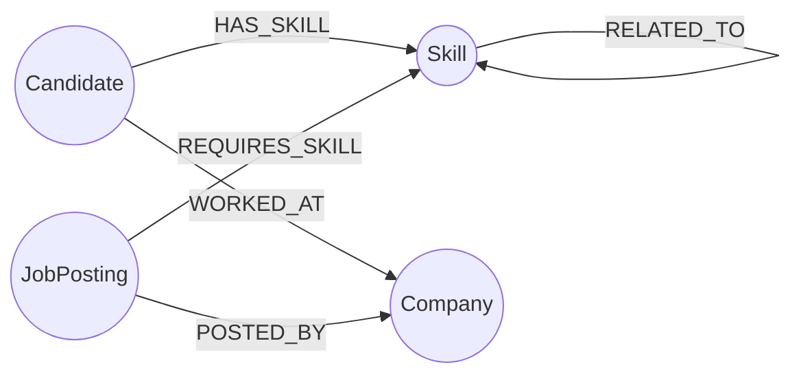

# TalentGraph

A skill-based candidate/job matching platform, backed by **CognoDB** (openCypher over Bolt).

Recruiters and hiring managers can browse open roles and see candidates ranked by an actual
traversal of a skills graph — including candidates who don't hold a required skill outright but
hold something closely related to it — instead of a keyword match against a résumé blob.

> Built for the Wexa AI take-home assignment.

---

## 1. Why a graph database?

Skill-based matching is, at its core, a **connections** problem: *who is linked to what, through
how many hops, and how strong is that link* — not a rows-and-columns problem.

- **The core query is inherently multi-hop.** Matching a job to candidates means traversing
  `JobPosting → REQUIRES_SKILL → Skill ← HAS_SKILL ← Candidate`, then, separately,
  `JobPosting → REQUIRES_SKILL → Skill → RELATED_TO → Skill ← HAS_SKILL ← Candidate` to catch
  candidates with an *adjacent* skill instead of an exact one. In Cypher this is two short,
  readable pattern matches. In SQL it's a variable number of self-joins against a
  `candidate_skills` bridge table — one join per required skill — plus a second join layer for
  the adjacency fallback, or a recursive CTE to make the join count dynamic. The query stops
  reading like the question you're actually asking.
- **The relationships carry data, not just existence.** `HAS_SKILL` carries `proficiency` and
  `yearsUsed`; `REQUIRES_SKILL` carries `importance`. Scoring a match means reading properties off
  the *edge itself* mid-traversal, which is natural in a property graph and awkward to express
  cleanly in a join.
- **"People like this candidate" is a same-shape query, not a new subsystem.** Candidate-to-
  candidate similarity (`Candidate → HAS_SKILL → Skill ← HAS_SKILL ← Candidate`) is the same
  2-hop pattern as job matching, just started from a different node. No separate similarity index
  or precomputed table needed.
- **The schema is expected to grow sideways.** Adding "candidates who worked at companies in the
  same industry as the hiring company" or "skills commonly learned together" is a new relationship
  and a new pattern match, not a new join table and a migration.

A relational schema *could* model this (bridge tables for `candidate_skills` and
`job_required_skills`, a self-referencing `skill_relations` table), but every one of the queries
above would need to hard-code how many hops to join, and adding one more hop of reasoning means
adding one more join to every query that touches it. The graph model expresses "how far do you
want to look" as a query-time decision instead of a schema-time one.

## 2. Data model



**Nodes**

| Label | Key properties |
|---|---|
| `Candidate` | `id`, `name`, `email`, `location`, `yearsExperience` |
| `Skill` | `name` |
| `Company` | `name`, `industry` |
| `JobPosting` | `id`, `title`, `description`, `location`, `postedDate` |

**Relationships**

| Relationship | Direction | Properties |
|---|---|---|
| `(:Candidate)-[:HAS_SKILL]->(:Skill)` | Candidate → Skill | `proficiency`, `yearsUsed` |
| `(:Candidate)-[:WORKED_AT]->(:Company)` | Candidate → Company | `title`, `startDate`, `endDate` |
| `(:JobPosting)-[:REQUIRES_SKILL]->(:Skill)` | Job → Skill | `importance` (`must-have` / `nice-to-have`) |
| `(:JobPosting)-[:POSTED_BY]->(:Company)` | Job → Company | — |
| `(:Skill)-[:RELATED_TO]->(:Skill)` | Skill → Skill | — (e.g. PostgreSQL ↔ MySQL, TensorFlow ↔ PyTorch) |

## 3. Project structure

```
talentgraph/
├── server/                  Express API + CognoDB access layer
│   ├── src/
│   │   ├── db/
│   │   │   ├── driver.js    Driver singleton, connectivity check, error handling
│   │   │   └── queries.js   Every Cypher query used by the app, documented
│   │   ├── routes/api.js    REST endpoints, all parameterized queries
│   │   ├── scripts/seed.js  Loads sample companies/skills/candidates/jobs
│   │   └── index.js         App entry point
│   └── .env.example
├── client/                  React + Vite frontend
│   ├── src/
│   │   ├── pages/           JobsPage, JobDetailPage, CandidatesPage, CandidateDetailPage
│   │   ├── components/      NavBar, MatchPath (the visual match-path signature element), States
│   │   ├── api.js           Fetch wrapper
│   │   └── styles.css       Design tokens + layout
│   └── .env.example
└── README.md
```

## 4. Set up CognoDB Cloud

1. Sign up at [console.cognodb.com/signup](https://console.cognodb.com/signup) — no credit card
   needed for the free tier.
2. Create a free **c0** instance and pick a region. It provisions in under a minute.
3. Copy the connection URI (`bolt+s://<instance-id>.databases.cognodb.cloud`) and the generated
   password for user `cognodb` — **the password is shown once**, so save it immediately.

## 5. Run it locally

**Backend**

```bash
cd server
npm install
cp .env.example .env
# edit .env with your CognoDB URI, user, and password
npm run seed     # loads sample data — safe to re-run, clears old data first
npm run dev      # starts the API on http://localhost:4000
```

**Frontend**

```bash
cd client
npm install
cp .env.example .env   # defaults to http://localhost:4000/api, fine for local dev
npm run dev             # starts the app on http://localhost:5173
```

Open `http://localhost:5173`. The nav bar shows a live `cognodb connected` / `cognodb unreachable`
status pill, and every page shows a friendly error state instead of a crash if the API or database
is down.

## 6. The main queries, explained

All queries live in `server/src/db/queries.js`, each with a comment explaining the traversal.

- **`MATCH_CANDIDATES_FOR_JOB`** — the core matching query. From a job posting, traverses out to
  its required skills and back in to every candidate holding one of them, scoring by how many
  requirements are covered (weighted so `must-have` skills count double) — a multi-hop traversal
  with edge-property-aware scoring.
- **`ADJACENT_CANDIDATES_FOR_JOB`** — a 3-hop path (`JobPosting → Skill → Skill → Candidate`) that
  surfaces candidates missing a required skill but holding something `RELATED_TO` it. This is the
  query a relational schema would find genuinely awkward: it needs a self-referencing adjacency
  table plus another bridge-table join, layered on top of the direct-match join.
- **`SIMILAR_CANDIDATES`** — "people with an overlapping skill set", a symmetric 2-hop traversal
  (`Candidate → Skill ← Candidate`) used on the candidate detail page.

Every query is called through `runQuery()` in `db/driver.js`, which binds parameters via the
official Neo4j driver — nothing is ever string-concatenated into Cypher.

## 7. Deploying

Any free hosting tier works. A straightforward path:

- **API**: deploy `server/` to [Render](https://render.com) (free web service) — set
  `COGNODB_URI`, `COGNODB_USER`, `COGNODB_PASSWORD`, and `CLIENT_ORIGIN` as environment variables
  in the dashboard, build command `npm install`, start command `npm start`.
- **Frontend**: deploy `client/` to [Vercel](https://vercel.com) or
  [Netlify](https://netlify.com) — set `VITE_API_URL` to your deployed API's `/api` URL, build
  command `npm run build`, output directory `dist`.

Keep the CognoDB instance running after submission — the assignment notes they may test the app
against live data.

## 8. Screenshots

_Add screenshots of the Jobs page, a Job detail page with matches, and a Candidate detail page
here before submitting — run the app locally or against your deployed URL and capture them._

## 9. Error handling

- The driver's `verifyConnectivity()` runs on server boot and the result is exposed at
  `GET /api/health`, which the frontend polls for the status pill in the nav bar.
- Every route that touches the database is wrapped so a database-unreachable error becomes a
  clean `503` with a message, not an unhandled crash — the frontend renders this as a "the graph
  didn't respond" state with a retry button, not a blank page.
